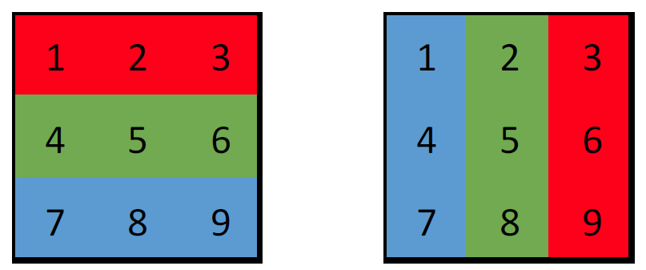
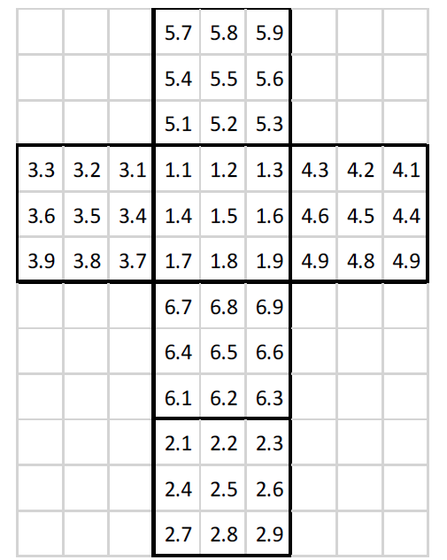

# Rubik’s Cube Project
## AIM
The aim for this project was to create a fully functional Rubik’s cube that could be visualised and interacted with in Matlab. Originally I had planned to get the program to solve the cube from any starting position, however, when solving the cube, there are certain steps that are made using human intuition that would be very hard to replicate with a computer. Therefore, I decided to simply create a cube that would automatically scramble itself and allow the user to solve it.


## BACKGROUND & THEORY
### Structure of the cube
The Rubik’s cube is a toy designed to be challenging to solve, with complex algorithms often being needed to solve the patterns, and it is something that many people still cannot do without dedicating some time to learn. There are 6 faces on the cube with 9 total squares per face in a 3 by 3 layout. The central square on each face designates which colour the face is and it never changes, however the outside faces can move freely when a side is rotated.
Apart from the 6 central pieces, there are 8 corner pieces with 3 squares each, and 8 edge pieces with 2 squares each. This means there are 22 individual pieces and 54 individual squares.
There are 12 possible moves to make with a Rubik’s cube, these are done by turning each one of the faces either clockwise or counter clockwise.
One of the first challenging puzzles involving patterns that I attempted was a Rubik’s cube, and it was also the first time that I had heard the words algorithms. After practice I learned how to solve it and I decided that, for my first large Matlab project, it would interesting to give it a go.

### Displaying and rotating the cube
I had to find a way to display the cube, and so I decided to plot the coloured squares in 3D, there would be 9 squares per face and 6 faces in total. I realised that I needed a stationary reference point, because if I rotated one face (which would change the location of certain squares) and then tried to rotate it again, the original squares would be in a  different location and so it would cause the
cube to rotate in strange ways. And so instead of moving the squares, I decided to keep the actual cube in the exact same position, and only alter the colours. This would give the illusion that the square is moving and each time I chose to rotate a certain way, the colour of one square would change to represent how it would look if it had been rotated. 

For example, if you imagine a 3x3 square matrix numbered [1,2,3;4,5,6;7,8,9] where 1,2,3 (row 1) was red, 4,5,6 (row 2) was green, and 7,8,9 (row 3) was blue. The rotate function could then tell the cube to apply the colour of squares 1, 2, 3 to squares 3, 6, 9. And to apply the colour of squares 4, 5, 6 to squares, 2, 5, 8. And to apply the colour of 7, 8, 9 to squares 1, 4, 7.  (See image below)



What that is actually doing is rotating the face that you are looking at 90 degrees clockwise. By applying the above changes, it would then make column 1 blue, column 2 green, and column 3 red.

Now to understand the reason behind changing the colours and not the
actual squares, think about applying the same pattern again. If the actual squares moved, eventually the original squares would be all over the place and it would be very difficult to create an algorithm
that could rotate one face, when all the numbers of that face were mixed up. 

So by keeping the squares in the same position the whole time. Every time I call on a function to make a rotation, it will behave in the same way as the time before it and the time after it.

### Controlling the cube

I also wanted to create a GUI that would allow the rotations of the cube to be chosen on the plot screen. I chose to have a drop down menu that would rotate the face colour that was chosen. One menu would be for clockwise and one would be for anticlockwise. To solve the cube I needed to be able to flip the cube upside down. The rotation of a plot in Matlab is not completely free, and it cannot rotate so that the bottom of the cube was at the top and so I needed to create another element of the GUI that would flip the cube upside down.

This was done by changing the xdir, ydir, and zdir to reverse and then changing them back to normal. By creating two small functions that inverted and reverted the axes, they could be called by a GUI.

This then gave me a way to choose which face that I wanted to rotate, which direction I wanted to rotate it, and whether I wanted to flip the cube and work on the bottom face. The in-built rotation in Matlab’s graph was used to turn it.

### The adjoining sides of the face to rotate

This was the biggest issue with the rotations. Once I had assigned a colour to each of the squares on a face, it was quite easy to use the 'rot90' function to rotate the colours. But on a Rubik’s cube, when a face turns, the edges attached to those faces also has to move.

To overcome this problem, I had to tell each square what face and number on that face that it is attached to. For example a corner will be attached to two other squares on two other faces. And when the face rotates, it also tells these adjoining squares to rotate with it. Once these issues were addressed, the cube could function normally.

### Scrambling the cube
One of the first things that happen when solving is a Rubik’s cube is to have someone scramble it for you. And so when I have the cube functioning properly and rotating perfectly, I needed to have a way to scramble it for the user. And so I decided to get Matlab to create a random vector of 30 integers between 1 and 6. What would then happen is that the function that rotates the cube would be given this random vector as the face that is to be rotated, and so 30 random moves would be made to simulate a stranger scrambling the cube for you. By adding a pause the end, it will show each move one by one so the user can see the cube being scrambled.

```
Pseudocode for the scrambling function

ScrambleVector = 30 random numbers from 1 to 6;
    For Range = 1:1:30
        RotateFace(ScrambleVector(Range))
        Plot new cube ;
        
        Pause(0.5)
    end
```

### Checklist
Now that the objectives have been stated and the idea behind the cube has been detailed. The following steps need to be completed.

- Plot the 6 faces of a cube with the correct colours
- Create a function that will rotate one face
  - Include the ability to rotate the adjoining edges of the face
- Create a gui menu to control the rotations of the cube
- Use a button tto invert the cube
- Create a function scramble function


## How the program works
The program is essentially 54 plotted squares in three dimensions in order to make a cube (9 squares per face & 6 faces). They were plotted with the patch() function and assigned a certain colour depending on the face. Multiple functions are in place that rotate the cube, scramble and unscramble, create faces, assign the correct position for the squares, turn the cube upside down etc.

A vector of colours was created so that certain colours could be called and so that the exact colour could be kept track of.

All of the 6 faces were placed into a structure titled “faces”. This structure contains 5 fields. The first two fields define the face and the colour of each square on that face;

- Which face it was (1 to 6). (faceNumber)
- The colour of each square on that face in a 3x3 matrix. (Also 1 to 6) (squareColourNumbers)

The last 3 fields in the “faces” structure are essential in allowing the Rubik’s cube to turn correctly.

With a Rubik’s cube, when one side is turned the squares int the nearest row of the adjoining faces also rotates. And so to allow this to occur, every square except the centre pieces must be linked to its neighbours. When they are linked, if the numbers on the face that they are linked to rotates, then the adjoining faces will also rotate. The following picture shows the flat packed cube and the numbers represent the face and the square respectively. The numbers are chosen based on the order that the squares on that face were created, and by printing the number onto the square as it was created, I could make a note of how they all interacted with each other. Here is a flat view of the cube.




## *In the process of uploading the rest of the documentation*
